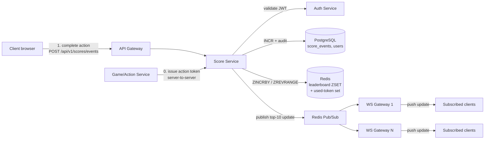
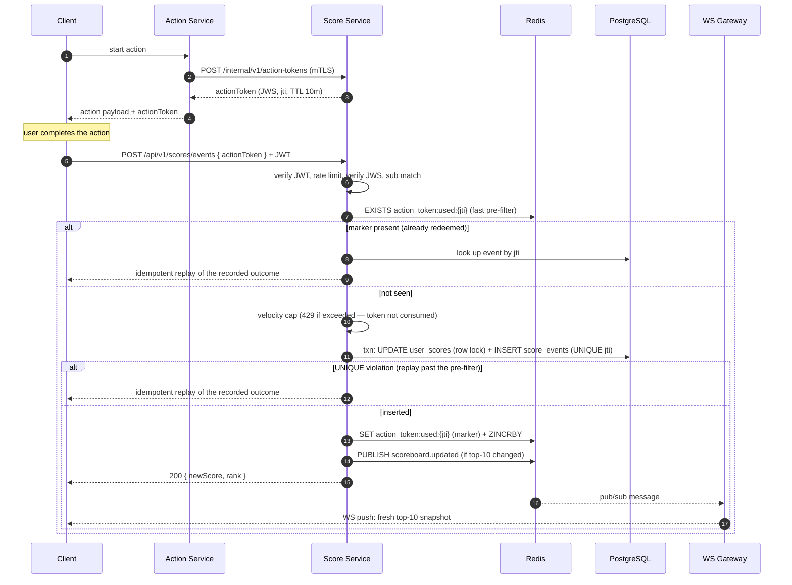

# Live Scoreboard Module — Specification

> Specification for the **Score Service** module of the API application server.
> Audience: the backend engineering team implementing it. Everything in this
> document is implementable as written; open questions are collected at the end.

## 1. Overview

The website shows a scoreboard with the **top 10 users by score**, updated **live**. Users complete an *action* (its nature is out of scope); completing an action increases the user's score via an API call. The module must make unauthorized score increases practically impossible.

### In scope

- Receiving and validating score-increment events
- Maintaining the leaderboard and each user's current score
- Broadcasting live top-10 updates to connected clients
- Anti-abuse controls and an auditable score history

### Out of scope (integration points)

- User registration / login (we consume the existing **Auth Service** JWTs)
- The gameplay/action logic itself (we consume its completion signal)
- Frontend rendering of the scoreboard

### Assumptions (declared per the challenge instructions)

- An Auth Service issuing user JWTs already exists (implied by "prevent unauthorized").
- Scores only increase (requirement 3); corrections are compensating events, not mutations.
- One global leaderboard for now — §9.3 keys the design so per-period boards are a config change.
- The action has a server-known start (needed to issue the action token); §9.7 raises the open question if that doesn't hold.

## 2. The core security decision

**The client is never trusted to declare "add N points."** The naive design — `POST /score {points: 100}` guarded only by a login token — fails requirement 5: any logged-in user can replay the call in a terminal.

Instead, score increments are redeemed from **single-use, server-issued action tokens**:

1. When the user *starts* an action, the service that owns the action requests an **action token** from the Score Service (server-to-server) and hands it to the client embedded in the action.
2. When the user *completes* the action, the client submits that token.
3. The Score Service verifies the token's signature, expiry, audience (this user), and **single-use** status, then applies the score delta **defined server-side for that action type** — the client never sends a points number.

This turns "prevent malicious score increases" from a heuristics problem into a key-management problem, which is a much stronger position.

## 3. Architecture



| Component | Responsibility | Technology (recommendation) |
|---|---|---|
| Score Service | Token issuing/redemption, score mutation, audit | Node.js/TypeScript (fits existing stack) |
| Leaderboard store | Ranked top-N queries in O(log n) | Redis **sorted set** (`ZINCRBY`, `ZREVRANGE WITHSCORES`) |
| System of record | Durable per-event audit trail, rebuild source | PostgreSQL |
| Live channel | Fan-out of top-10 changes | WebSocket gateway(s) subscribed to Redis Pub/Sub |
| Auth Service | Issues the user JWTs we verify | existing |

**Why both Redis and Postgres:** Redis answers "top 10" in sub-millisecond time but is a cache, not a ledger. Every accepted event is written to `score_events` first (append-only); the Redis ZSET can be rebuilt from Postgres at any time (`SUM(delta) GROUP BY user_id`). If Redis and Postgres disagree, Postgres wins.

## 4. Data model

```sql
-- Materialized per-user total, owned by this module. Updated in the same
-- transaction as the ledger insert; its row lock serializes concurrent
-- redemptions for one user and yields score_after atomically.
CREATE TABLE user_scores (
  user_id UUID PRIMARY KEY REFERENCES users(id),
  score   BIGINT NOT NULL DEFAULT 0
);

-- Append-only ledger. Never UPDATE; corrections are compensating events.
CREATE TABLE score_events (
  id            UUID PRIMARY KEY DEFAULT gen_random_uuid(),
  user_id       UUID        NOT NULL REFERENCES users(id),
  action_type   TEXT        NOT NULL,          -- e.g. 'daily_quest'
  delta         INTEGER     NOT NULL CHECK (delta > 0),
  score_after   BIGINT      NOT NULL,          -- running total after this event: makes the
                                               -- idempotent replay reconstructible (§5.2) and
                                               -- the ledger self-auditing (§8)
  action_token_id UUID      NOT NULL UNIQUE,   -- DB-level replay protection
  created_at    TIMESTAMPTZ NOT NULL DEFAULT now()
);
CREATE INDEX idx_score_events_user ON score_events (user_id, created_at);

-- Server-side score table per action type: the client never chooses `delta`.
CREATE TABLE action_score_rules (
  action_type   TEXT PRIMARY KEY,
  delta         INTEGER NOT NULL CHECK (delta > 0),
  max_per_user_per_hour INTEGER NOT NULL      -- velocity cap
);
```

Redis keys:

| Key | Type | Purpose |
|---|---|---|
| `leaderboard:global` | ZSET (member = user_id, score = total) | `ZINCRBY` on accept; `ZREVRANGE 0 9 WITHSCORES` for top 10 |
| `action_token:used:{jti}` | STRING, TTL = remaining token lifetime + 1 min margin | fast replay **pre-filter** — the authoritative barrier is the DB `UNIQUE` (§5.2 step 7) |
| `velocity:{user_id}:{action_type}:{hour}` | INT with 1h TTL | rate/velocity counting |

## 5. API specification

All endpoints require `Authorization: Bearer <user JWT>` unless noted. Errors use `{ "error": { "code", "message" } }`.

### 5.1 `POST /internal/v1/action-tokens` *(server-to-server only, mTLS / service key)*

Called by the Action/Game service when a user starts an action.

```jsonc
// request
{ "userId": "u-123", "actionType": "daily_quest" }
// 201 response
{ "actionToken": "<JWS>", "expiresAt": "2026-07-07T12:34:56Z" }
```

The token is a signed JWS containing `{ jti, sub: userId, act: actionType, iat, exp }`. TTL: the action's expected max duration (default **10 min**). Not stored server-side — statelessly verifiable; only *redemption* is recorded.

### 5.2 `POST /api/v1/scores/events` — redeem a completed action

```jsonc
// request — note: no points field exists
{ "actionToken": "<JWS>" }
// 200 response
{
  "data": {
    "userId": "u-123",
    "delta": 10,
    "newScore": 1250,  // score_after from the ledger — part of the idempotency contract
    "rank": 7          // exact rank via ZREVRANK + 1, O(log n). Point-in-time view of a
                       // moving board — explicitly NOT part of the idempotency contract
  }
}
```

Validation pipeline (order matters — cheapest and most-likely-to-fail first):

| Step | Check | Failure |
|---|---|---|
| 1 | JWT valid, user active | `401 UNAUTHENTICATED` |
| 2 | Rate limit: ≤ 10 redemptions/min/user (burst 20) | `429 RATE_LIMITED` + `Retry-After` |
| 3 | Action token signature + `exp` | `401 INVALID_ACTION_TOKEN` |
| 4 | `token.sub === jwt.sub` (no redeeming someone else's token) | `403 TOKEN_USER_MISMATCH` |
| 5 | Fast replay pre-filter: `EXISTS action_token:used:{jti}` — an already-redeemed token short-circuits here, **before** the velocity check, so retries never consume quota or hit the cap | marker hit → **same idempotent path as step 7**: look up the event by `jti`, return the recorded outcome; `409 TOKEN_ALREADY_USED` only if no ledger record exists (anomaly — impossible under DB-first ordering) |
| 6 | Velocity: per-user per-action-type hourly cap — checked **before** the token is consumed, so an over-cap user's token is not burned. The counter increments only on accept (step 8), so rejected and replayed requests don't eat quota | `429 VELOCITY_EXCEEDED` (flag for review) |
| 7 | One transaction: `UPDATE user_scores SET score = score + delta RETURNING score` (row lock serializes concurrent redemptions per user, yields `score_after`) + insert `score_events` — the `UNIQUE(action_token_id)` constraint is the **authoritative** single-use barrier | `UNIQUE` violation → idempotent: look up the recorded event by `jti`, return the recorded outcome |
| 8 | Mark `action_token:used:{jti}` (TTL = remaining token lifetime + 1 min margin) + increment the velocity counter | best-effort |
| 9 | `ZINCRBY leaderboard:global delta user_id` | — |
| 10 | If top-10 changed → publish to Pub/Sub | — |

**Why the ledger writes before the Redis marker (ordering is load-bearing):** the durable store must be the authority on "was this token used", and the cache only a fast path. If the order were reversed (mark in Redis, then insert), a crash between the two would burn the token with no ledger record — the user's points would be unrecoverable and a retry would see `409`. With DB-first, every crash window is safe: crash after step 7 → the ledger has the event, a client retry hits the `UNIQUE` violation and receives the recorded outcome (natural idempotency); Redis staleness (marker or ZSET) is repaired by the reconciliation job (§8). The ledger is never wrong.

**One client-visible contract, whichever layer catches it — and what it covers:** a repeat redemption returns the **recorded outcome**: `delta` and `newScore = score_after`, read from the ledger (this is why `score_events` stores `score_after` — without it the ledger could only reconstruct `userId + delta`, and the promise would be unimplementable). `rank` is deliberately **excluded** from the guarantee: it is a point-in-time view of a moving board, recomputed live on every response — freezing it would be meaningless, and pretending to replay it would be a lie. The pre-filter is an optimization and must not change observable semantics; if step 5 returned a bare `409` while step 7 replayed the recorded outcome, the *common* retry path (response lost in transit, marker already set) would break the idempotency promise that the *rare* path (crash window) keeps. For the same reason the replay check runs *before* the velocity cap: a retry is not new activity, so it must neither consume quota nor be rejected by it. Replaying the outcome to the same user is safe: step 4 guarantees no other principal can redeem this token at all.

### 5.3 `GET /api/v1/scoreboard` *(public, no auth)*

```jsonc
// 200 response
{
  "data": [
    { "rank": 1, "userId": "u-9", "displayName": "alice", "score": 9310 },
    ...
  ],
  "asOf": "2026-07-07T12:00:03Z"
}
```

Serves the initial page render (and the fallback for clients without WebSocket). Backed directly by `ZREVRANGE`; may additionally be micro-cached for 1s at the gateway under heavy load.

### 5.4 `WS /api/v1/scoreboard/live` — live updates

- On connect: server immediately sends a `snapshot` frame (same shape as 5.3).
- On change: server pushes a full top-10 `snapshot` frame — **not diffs**. The payload is ~10 rows; diff bookkeeping isn't worth the client-side complexity or the risk of missed-frame drift.
- Heartbeat ping every 30s; clients reconnect with exponential backoff and get a fresh snapshot on reconnect, so no event replay is needed.

```jsonc
{ "type": "snapshot", "asOf": "...", "data": [ /* top 10 */ ] }
```

**Why WebSocket over SSE:** either works for one-way pushes (SSE would be acceptable and simpler); WebSocket is chosen for parity with likely future needs (per-user rank updates, presence). If the team prefers SSE for infra simplicity, this spec's flow is unchanged — swap the transport.

## 6. Flow of execution



ASCII fallback (same flow):

```
Client          Action Svc        Score Svc          Redis        Postgres      WS Gateway
  |--start-------->|                  |                 |              |             |
  |                |--issue token---->|                 |              |             |
  |<--action+token-|<-----JWS---------|                 |              |             |
  |  (user completes action)          |                 |              |             |
  |--redeem token + user JWT--------->|                 |              |             |
  |                |                  |--EXISTS used?-->| (pre-filter) |             |
  |                |                  |--txn: total + event (UNIQUE)-->| (authority) |
  |                |                  |--SET+ZINCRBY--->|              |             |
  |                |                  |--PUBLISH------->|---top-10 changed---------->|
  |<--200 {newScore, rank}------------|                 |              |             |
  |<=================== WS: new top-10 snapshot ================================...=|
```

## 7. Threat model — requirement 5, explicitly

| Attack | Defense |
|---|---|
| Forged/handcrafted API call with arbitrary points | No points field exists; deltas come from `action_score_rules` server-side |
| Replaying a captured legitimate request | Single-use `jti`: DB `UNIQUE(action_token_id)` is the authoritative barrier, with a Redis marker as fast pre-filter. A replay never scores twice — the same user gets the recorded outcome replayed (idempotency), any other principal fails the `sub` check first |
| Redeeming a token issued to another user | Step 4: token `sub` must equal JWT `sub` |
| Minting tokens client-side | Tokens are signed with a key that never leaves the server (issuing endpoint is internal-only, mTLS) |
| Completing actions inhumanly fast (botting) | Per-user rate limit + per-action-type velocity caps; breaches are flagged, not just rejected |
| Stolen JWT | Standard JWT TTL/rotation (Auth Service); velocity caps bound damage; audit ledger enables exact rollback via compensating events |
| Score tampering in storage | Redis is a rebuildable cache; Postgres ledger is append-only and access-controlled |

## 8. Operations

- **Reconciliation job** (every 5 min): compare the ZSET against `user_scores`, repair drift, alert if drift > 0. The ledger is self-auditing: for every user, `SUM(delta)` must equal the latest `score_after` must equal `user_scores.score` — three records of the same fact that cannot silently diverge.
- **Cold start / Redis loss**: rebuild the entire ZSET from the ledger in one query; scoreboard degrades to §5.3 polling in the meantime, nothing is lost.
- **Metrics**: redemption rate, idempotent-replay rate per user (replays return `200`, so probing shows up here, not in 4xx — a per-user spike = replay probing or a broken client retry loop), WS connection count, pub/sub fan-out latency (target: action completion → client repaint p95 < 500 ms).
- **Scaling**: Score Service and WS gateways are stateless → horizontal scale behind the LB; Redis Pub/Sub decouples them. Single Redis handles ~100k `ZINCRBY`/s — sharding is a non-problem until far beyond this product's scale.

## 9. Additional comments / suggested improvements

*(requested by the task — recommendations to the team beyond the stated requirements)*

1. **Idempotency is built in — document it as a client contract.** The `jti` acts as the idempotency key: a retry after a network timeout receives the recorded outcome (`delta`, `newScore`), not an error, *whichever barrier catches it* (§5.2 steps 5 and 7 deliberately converge on the same behavior; `rank` is live and excluded). Spell this out in the client-facing API docs so mobile teams retry with confidence instead of inventing their own dedupe.
2. **Don't build diff-based WS frames.** Teams instinctively optimize this; at 10 rows the snapshot *is* the optimization. Revisit only if the board grows to hundreds of visible rows.
3. **Season/period support will be asked for.** Keying the ZSET as `leaderboard:{period}` (e.g. `2026-W28`) from day one costs nothing and makes "weekly leaderboard" a config change instead of a migration.
4. **Display names on the board**: resolve via a small cached user-profile lookup in the WS gateway, not stored in the ZSET — avoids rename-propagation bugs.
5. **Anomaly review queue, not auto-bans.** Velocity breaches should flag `score_events.flagged = true` for human review; auto-punishing false positives on a public leaderboard is a support nightmare.
6. **Consider signing the WS snapshot `asOf`** so the frontend can ignore out-of-order frames after reconnects.
7. **Open question for the action team:** can one user legitimately run several actions concurrently? If yes, keep the 10-minute token TTL; if strictly sequential, drop it to ~2× median action duration to shrink the replay window further.

## 10. Definition of done (for the implementing team)

- [ ] All §5 endpoints implemented with the exact error codes in the validation table
- [ ] Both replay layers in place (Redis pre-filter + DB `UNIQUE` authority) with a test proving a token can never score twice even when Redis is flushed mid-test — the retry must receive the idempotent replay of the recorded outcome, not a second score and not an error
- [ ] Load test: 1k redemptions/s sustained, WS repaint p95 < 500 ms
- [ ] Reconciliation job + drift alert wired to on-call
- [ ] Runbook: Redis loss recovery drill executed once
